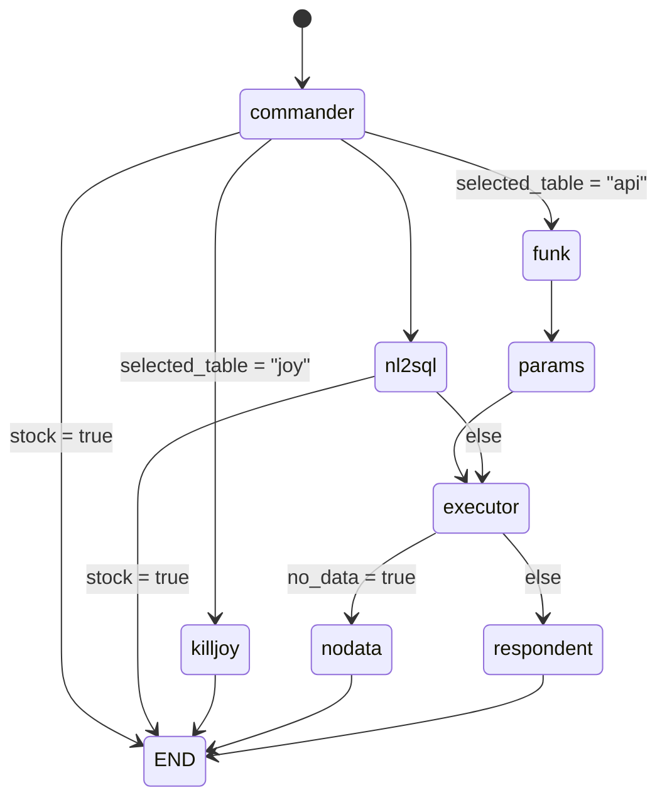

## Agent Architecture(goodbye yadon...)
yadon --> yadoran: shellder = "1"
yadon --> commander: shellder = "0"

yadoran --> commander




## 환경설정
가상환경 설정 및 dependancy 설치 
(macOS)  
```bash
python3 -m venv venv
source venv/bin/activate
python3 -m pip install requirements.txt
```

(Window PowerShell)  
```
python -m venv venv
.\venv\Scripts\Activate
python -m pip install -r requirements.txt
```

(Window cmd)  
```
python -m venv venv
venv\Scripts\activate
python -m pip install -r requirements.txt
```

## 주석 스타일(자세함보다는 효율성)
    """(따옴표에 붙여서, 되도록이면 한 줄로, 불필요한 줄바꿈 no) 함수에 대한 간단한 설명
    Args: 헷갈릴 경우 적지만, 함수 정의에서 알아볼 수 있을 경우 되도록 적지 않습니다
    Returns:
    Raises:
    """